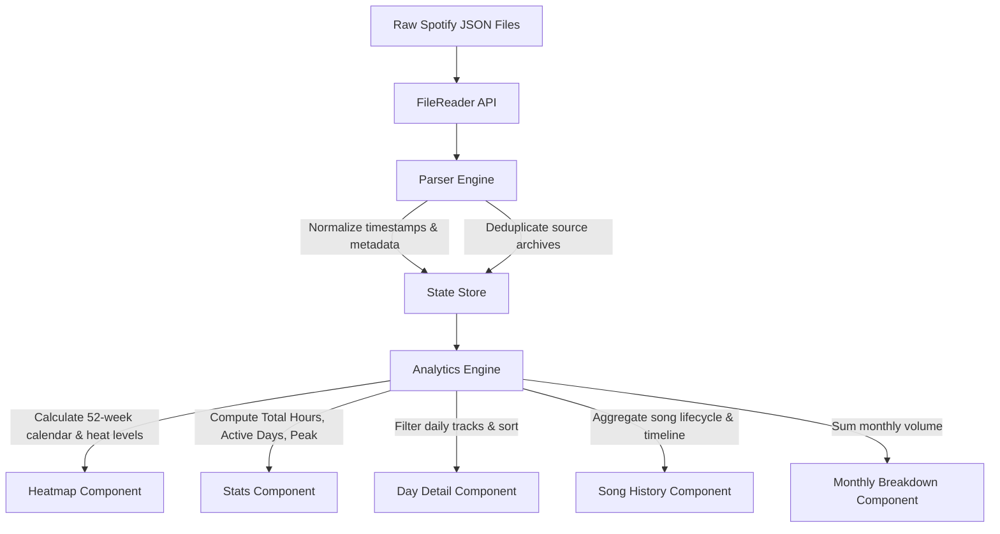

# 🎧 Spotify Heatmap Visualizer

<p align="center">
  <strong>An interactive, client-side data visualization suite that transforms your lifetime Spotify Extended Streaming History into an analytical dashboard and GitHub-style contribution heatmap.</strong>
</p>

<p align="center">
  
  
  
  
  
  
</p>

---

## 🌟 Overview

**Spotify Heatmap Visualizer** is a high-performance, privacy-first web application engineered to parse, normalize, and visualize years of personal Spotify streaming history. 

Unlike standard annual recaps (e.g. Spotify Wrapped), this tool processes your raw **Extended Streaming History JSON archives**, merging multiple files spanning across years, deduplicating records, and presenting deep granular insights into your listening habits—all executed 100% inside your browser with **zero server uploads or telemetry**.

---

## ✨ Key Features

- 🟩 **GitHub-Style Contribution Heatmap**: A complete 52-week calendar grid showing daily listening density across multiple intensity tiers calculated dynamically against your annual listening peak.
- ⚡ **Multi-File Batch Merging & Deduplication**: Drag and drop all your `Streaming_History_Audio_*.json` files at once. The engine automatically merges timelines and resolves overlapping ranges.
- 🔍 **Granular Day Inspector**: Click any calendar cell to view chronological play-by-play timelines, listening durations, skip records, play trigger reasons, and originating source files.
- 🎵 **Comprehensive Track Lifecycle Drilldown**: Search any song or artist to reveal:
  - Exact timestamp of your **first listen ever** and first play duration
  - Lifetime play counts and total accumulated listening time
  - Skip rates and shuffle habits
  - Preferred listening platforms (iOS, Android, macOS, Web Player, Cast)
  - Top transition sources (*searched*, *ongoing playlist*, *autoplay*, *manual skip*, *app launch*)
  - Associated in-app search queries from your search logs
- 📊 **Monthly Listening Velocity**: Interactive distribution bar charts showing seasonal fluctuations in listening minutes per year.
- 🎛️ **Multi-Dimensional Filters**: Filter your entire dashboard on the fly by Year, Month, Play Trigger Source (*searched*, *playlist*, *manual*, *app*), Day Activity status, and sort by duration, track title, or time of day.
- 🔒 **Zero-Server Privacy Guarantee**: Files are read directly via the browser's `FileReader` API. No account logins, Spotify API keys, cloud databases, or network transmissions required.

---

## 📦 How to Download Your Spotify Data

To get the full dataset with exact timestamps, skip indicators, and track URIs, you must request your **Extended Streaming History** from Spotify.

> [!IMPORTANT]
> Spotify offers two data packages: **Account Data** (basic profile data & past 1 year of plays) and **Extended Streaming History** (lifetime listening history). **Make sure to request the Extended Streaming History** to unlock full multi-year analysis!

### Step-by-Step Guide

1. **Log in to Spotify**:
   Navigate to the [Spotify Privacy Settings](https://www.spotify.com/account/privacy/) page in your web browser.

2. **Navigate to "Download your data"**:
   Scroll down to the section titled **"Download your data"**.

3. **Select "Extended streaming history"**:
   - You will see multiple options: *Account data*, *Technical log information*, and *Extended streaming history*.
   - Ensure the checkbox or request button for **Extended streaming history** is selected.
   - Click **Request data**.

4. **Confirm the Verification Email**:
   Spotify will send an automated security confirmation email to your registered email address.
   - Open the email with the subject line *"Confirm your data request"*.
   - Click the **"Confirm"** button inside the email.

5. **Wait for Preparation**:
   Because Spotify gathers every audio and video stream recorded since your account was created, generating the archive takes between **5 to 30 days**. You will receive an email once the package is ready.

6. **Download and Extract the ZIP**:
   - When notified, return to the link provided in the email and download the `.zip` archive (e.g. `my_spotify_data.zip`).
   - Extract the zip folder. Inside, you will find files named:
     - `Streaming_History_Audio_YYYY-YYYY_X.json` (audio stream records)
     - `Streaming_History_Video_YYYY-YYYY.json` (video podcast stream records)
     - `SearchQueries.json` (logs of your in-app searches)
     - `ReadMeFirst_ExtendedStreamingHistory.pdf` (Spotify's official schema documentation)

---

## 🚀 Getting Started

No build tools, bundlers, Node.js installations, or web servers are required!

### Option A: Open Locally
1. Clone or download this repository:
   ```bash
   git clone https://github.com/your-username/spotify-heatmap.git
   cd spotify-heatmap
   ```
2. Double-click **`index.html`** (or open it with Chrome, Safari, Firefox, Edge, or Brave).
3. Drag and drop all your `Streaming_History_Audio_*.json` files into the upload area.

### Option B: Deploy to GitHub Pages
1. Fork or push this repository to GitHub.
2. Navigate to **Settings** > **Pages**.
3. Under **Branch**, select `main` and root `/`, then click **Save**.
4. Access your live visualizer anywhere from `https://<your-username>.github.io/<repo-name>/`.

---

## 🏗️ Architecture & Codebase Structure

The project is structured with strict separation of concerns, modularized into reusable CSS and JS domains:

```
spotify-heatmap/
├── index.html                   # Semantic HTML5 application shell & entry point
├── spotify data visualiser.html # Legacy compatibility entry point
├── .gitignore                   # Excludes raw personal streaming history & zips
│
├── css/
│   ├── variables.css            # Design tokens, themes, palette & dark mode vars
│   ├── layout.css               # Responsive grid layout, app shell, media queries
│   └── components.css           # Drop zone, heatmap grid, stat cards, timelines, chips
│
├── js/
│   ├── constants.js             # Color ramps, month/weekday labels, enum mappings
│   ├── utils.js                 # ISO date normalization, duration/time formatters, sanitization
│   ├── state.js                 # Centralized reactive state store
│   ├── parser.js                # Ingestion engine, stream normalizer, file deduplication
│   ├── analytics.js             # 52-week calendar builder, heat tiers, metrics & filters
│   │
│   ├── components/
│   │   ├── heatmap.js           # Heatmap calendar grid & legend renderer
│   │   ├── stats.js             # Yearly KPI cards & year switcher tabs
│   │   ├── dayDetail.js         # Daily inspector & track list breakdown
│   │   ├── songHistory.js       # Search drilldown, play timeline & search query linker
│   │   └── monthlyBreakdown.js  # Monthly volume bar chart & imported files manifest
│   │
│   └── app.js                   # Application coordinator & event listener bootstrap
│
└── README.md                    # Project documentation & usage guide
```

### Data Pipeline Architecture



---

## 🛠️ Data Fields Supported

The normalization layer supports both standard and extended Spotify schemas:

| Field | Description | Source Attribute |
|---|---|---|
| **Timestamp** | UTC playback end timestamp | `ts` / `endTime` |
| **Duration** | Milliseconds played | `ms_played` / `msPlayed` |
| **Track Name** | Track or podcast episode title | `master_metadata_track_name` / `trackName` |
| **Artist Name** | Album artist or creator | `master_metadata_album_artist_name` / `artistName` |
| **Album Name** | Originating album title | `master_metadata_album_album_name` |
| **URI** | Spotify track or episode URI | `spotify_track_uri` |
| **Start Reason** | Trigger that caused the track to play | `reason_start` (e.g. `clickrow`, `playbtn`, `trackdone`) |
| **End Reason** | Trigger that ended playback | `reason_end` (e.g. `endplay`, `fwdbtn`, `unexpected-exit`) |
| **Skip Status** | Whether playback was skipped | `skipped` |
| **Platform** | Client OS or device model | `platform` (e.g. `iOS`, `OS X`, `Android`) |
| **Offline** | Whether stream was played offline | `offline` |

---

## 🔒 Privacy & Security

- **Zero Network Calls**: No data is ever sent to any remote server, analytics provider, or third-party service.
- **Client-Side Storage Only**: The files reside in browser memory during your active session and are released upon refreshing or closing the tab.
- **Git-Ignored Archives**: The included `.gitignore` ensures that personal streaming JSON files, zip downloads, and CSV exports remain local and are never accidentally pushed to a public Git repository.

---

## 📄 License

This project is not currently licensed. Feel free to use, modify, and distribute it.
